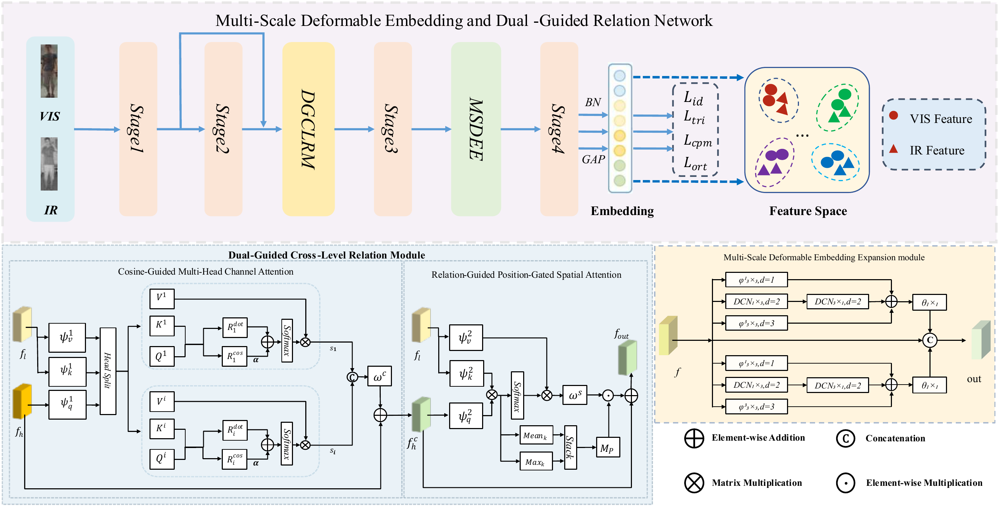

# Multi-Scale Deformable Embedding and Dual-Guided Relation Network for Visible-Infrared Person Re-Identification

> **Note to readers and reviewers:** This repository provides the PyTorch implementation of MDGRN for visible-infrared person re-identification (VI-ReID). The code contains the proposed Multi-Scale Deformable Embedding Expansion (MSDEE) module, Dual-Guided Cross-Level Relation Module (DGCLRM), training and evaluation scripts, baseline folders, and visualization tools used for the experiments in the paper.

---

## Table of Contents

1. [Overview](#1-overview)
2. [Repository Structure](#2-repository-structure)
3. [Environment Setup](#3-environment-setup)
4. [Dataset Preparation](#4-dataset-preparation)
5. [Training](#5-training)
6. [Testing](#6-testing)
7. [Main Results](#7-main-results)
8. [Ablation Studies](#8-ablation-studies)
9. [Visualization and Analysis](#9-visualization-and-analysis)
10. [Citation](#10-citation)
11. [Acknowledgments](#11-acknowledgments)

---

## 1. Overview

Visible-infrared person re-identification aims to retrieve the same identity across visible and infrared cameras. It is challenging because modality discrepancy, illumination changes, pose variation, and spatial misalignment can weaken local identity cues.

<p align="center">
  
</p>

<p align="center">
  Overall architecture of MDGRN.
</p>

MDGRN improves the intermediate representation process inside a DEEN-style backbone through two main components:

- **Multi-Scale Deformable Embedding Expansion (MSDEE):** combines fixed multi-scale perception with factorized deformable sampling to generate complementary local representations.
- **Dual-Guided Cross-Level Relation Module (DGCLRM):** selectively transfers reliable low-level information to high-level features using channel compatibility and spatial reliability guidance.
- **Cosine-guided Multi-Head Channel Attention (CMH-CA):** models channel-level cross-stage compatibility with grouped relations and cosine guidance.
- **Relation-Guided Position-Gated Spatial Attention (RPG-SA):** estimates spatial reliability from cross-level relation statistics and suppresses unreliable transferred responses.

### Key Implementation Files

| Component | File | Main Class / Function |
|---|---|---|
| MDGRN network | `model.py` | `embed_net` |
| MSDEE | `model.py` | `MSDEE_module`, `FactorizedDeformBranch` |
| DGCLRM | `model.py` | `DGCLRM_block` |
| CMH-CA | `model.py` | `CMH_CA` |
| RPG-SA | `model.py` | `RPG_SA`, `RelationPositionGate` |
| Training losses | `loss.py` | `OriTripletLoss`, `CPMLoss` |
| Training script | `train.py` | SYSU-MM01 / RegDB / LLCM training |
| Testing script | `test.py` | Multi-trial evaluation |
| Complexity analysis | `FLOPs_Params.py`, `Inference_Time.py` | FLOPs, params, latency, FPS |

---

## 2. Repository Structure

```text
MDGRN/
|-- README.md
|-- model.py                    # MDGRN model: MSDEE, DGCLRM, CMH-CA, RPG-SA
|-- train.py                    # Training script for SYSU-MM01, RegDB, LLCM
|-- test.py                     # Evaluation script
|-- extract.py                  # Feature extraction / t-SNE feature export
|-- loss.py                     # ID, triplet, CPM, orthogonality-related losses
|-- data_loader.py              # Dataset loaders
|-- data_manager.py             # Query/gallery split processing
|-- eval_metrics.py             # CMC, mAP, mINP evaluation
|-- pre_process_sysu.py         # SYSU-MM01 preprocessing to .npy files
|-- resnet.py                   # ResNet backbone
|-- utils.py                    # Logger, sampler, meters, seed utilities
|-- random_erasing.py           # Random Erasing augmentation
|-- FLOPs_Params.py             # FLOPs and parameter measurement
|-- Inference_Time.py           # Inference latency and FPS measurement
|-- requirements.txt
|-- train_regdb.bash
|-- Visualization/
|   |-- Grad-CAM.py             # Grad-CAM visualization
|   |-- heatmap.py              # MSDEE / DGCLRM response heatmap visualization
|   |-- t-SNE.py                # t-SNE visualization
|   |-- initial_t-SNE.py        # Initial feature t-SNE visualization
|   |-- inter-distance.py       # Intra/inter-class distance analysis
|   `-- sysu_rank10.py          # SYSU-MM01 top-10 retrieval visualization
|-- DEEN/                       # DEEN baseline
`-- AGW/                        # AGW baseline
```

---

## 3. Environment Setup

### Requirements

The implementation is based on PyTorch. The main dependency versions are listed in `requirements.txt`:

| Package | Version |
|---|---|
| torch | 2.0.1+cu118 |
| torchvision | 0.15.2+cu118 |
| numpy | 1.24.4 |
| scikit-learn | 1.3.2 |
| tensorboardX | 2.6.2.2 |
| thop | 0.1.1.post2209072238 |
| matplotlib | 3.7.5 |
| grad-cam | 1.5.5 |
| tqdm | 4.66.5 |

### Installation

```bash
git clone https://github.com/LXJ-0720/MDGRN.git
cd MDGRN
pip install -r requirements.txt
```

`torchvision.ops.DeformConv2d` is used by the deformable branch in MSDEE, so please make sure the installed `torch` and `torchvision` versions are compatible.

---

## 4. Dataset Preparation

Experiments are conducted on three public VI-ReID datasets:

| Dataset | Training Identities | Testing Identities | Protocol | Download |
|---|---:|---:|---|---|
| SYSU-MM01 | 395 | 96 | All-Search / Indoor-Search | [Official project page](https://www.isee-ai.cn/project/RGBIRReID.html), [GitHub instructions](https://github.com/wuancong/SYSU-MM01) |
| RegDB | 206 per split | 206 per split | 10-trial VIS->IR and IR->VIS | [Dataset page](http://dm.dongguk.edu/link.html) |
| LLCM | 713 | 351 | VIS->IR and IR->VIS | [GitHub / dataset page](https://github.com/ZYK100/LLCM), [CVPR paper page](https://openaccess.thecvf.com/content/CVPR2023/html/Zhang_Diverse_Embedding_Expansion_Network_and_Low-Light_Cross-Modality_Benchmark_for_Visible-Infrared_CVPR_2023_paper.html) |

### SYSU-MM01

Update the dataset path in `pre_process_sysu.py`, then run:

```bash
python pre_process_sysu.py
```

This generates:

```text
train_rgb_resized_img.npy
train_rgb_resized_label.npy
train_ir_resized_img.npy
train_ir_resized_label.npy
```

The loader in `data_loader.py` expects these files under the configured SYSU-MM01 data path.

### RegDB and LLCM

RegDB and LLCM are loaded from image lists. Keep the official split files in:

```text
RegDB/idx/
LLCM/idx/
```

Before training or testing, set the dataset root in `train.py` and `test.py` according to your local dataset location.

---

## 5. Training

### SYSU-MM01

```bash
python train.py --dataset sysu --gpu 0  --seed 0 --lr 0.1
```

### RegDB

Run all 10 trials and average the results:

```bash
python train.py --dataset regdb --gpu 0  --seed 0 --trial 1
python train.py --dataset regdb --gpu 0  --seed 0 --trial 2
# ...
python train.py --dataset regdb --gpu 0  --seed 0 --trial 10
```

### LLCM

```bash
python train.py --dataset llcm --gpu 0  --seed 0 --lr 0.1
```

### Main Training Arguments

| Argument | Description | Default |
|---|---|---|
| `--dataset` | Dataset name: `sysu`, `regdb`, or `llcm` | `sysu` |
| `--lr` | Initial learning rate | `0.1` |
| `--arch` | Backbone architecture | `resnet50` |
| `--batch-size` | Number of identities per batch | `6` |
| `--num_pos` | Images per identity per modality | `4` |
| `--img_h`, `--img_w` | Input image size | `384`, `144` |
| `--margin` | Triplet loss margin | `0.3` |
| `--erasing_p` | Random Erasing probability | `0.5` |
| `--lambda_1` | CPM loss weight | `0.8` |
| `--lambda_2` | Orthogonality loss weight | `0.01` |
| `--gpu` | GPU device id | `3` |
| `--trial` | RegDB trial id | `2` |
| `--resume` | Resume checkpoint | `''` |

### Training Settings Used in the Paper

| Setting | Value |
|---|---|
| Backbone | ResNet-50 initialized from ImageNet |
| Input size | 384 x 144 |
| Batch sampling | 6 identities x 4 images per modality |
| Optimizer | SGD, momentum 0.9, weight decay 5e-4, nesterov |
| Epochs | 150 |
| Learning rate | warmup 0.01 -> 0.1 in first 10 epochs; 0.1 for epochs 10-19; 0.01 for epochs 20-79; 0.001 after epoch 80 |
| Loss | `L_ce + L_tri + lambda_cpm L_cpm + lambda_ort L_ort` |
| Loss weights | `lambda_cpm = 0.8`, `lambda_ort = 0.01` |

Training outputs are saved to:

```text
save_model/
log/
log/vis_log/
```

---

## 6. Testing

### SYSU-MM01

```bash
python test.py --dataset sysu --mode all \
    --resume <checkpoint_name> --gpu 0 

python test.py --dataset sysu --mode indoor \
    --resume <checkpoint_name> --gpu 0 
```

For query-only random rectangle masking experiments, keep the gallery unchanged and set `--mask_ratio`:

```bash
python test.py --dataset sysu --mode all \
    --resume <checkpoint_name> --gpu 0 --mask_ratio 0.2 --mask_seed 0
```

### RegDB

For RegDB, `test.py` evaluates all 10 trials. Use `--tvsearch True` for thermal query to visible gallery and `--tvsearch False` for visible query to thermal gallery.

```bash
python test.py --dataset regdb --gpu 0  --tvsearch True
python test.py --dataset regdb --gpu 0  --tvsearch False
```

### LLCM

```bash
python test.py --dataset llcm \
    --resume <checkpoint_name> --gpu 0 
```

### Evaluation Metrics

The code reports the standard VI-ReID metrics:

- **CMC Rank-k**: Rank-1, Rank-5, Rank-10, Rank-20 retrieval accuracy.
- **mAP**: mean Average Precision.
- **mINP**: mean Inverse Negative Penalty.

---

## 7. Main Results

### SYSU-MM01 and RegDB

| Dataset | Setting | Rank-1 | Rank-10 | Rank-20 | mAP |
|---|---|---:|---:|---:|---:|
| SYSU-MM01 | All-Search | 76.71 | 97.44 | 99.26 | 73.61 |
| SYSU-MM01 | Indoor-Search | 83.61 | 99.13 | 99.84 | 85.80 |
| RegDB | VIS->IR | 91.65 | 97.93 | 99.00 | 84.89 |
| RegDB | IR->VIS | 89.80 | 97.20 | 98.77 | 83.34 |

### LLCM

| Setting | Rank-1 | Rank-10 | Rank-20 | mAP |
|---|---:|---:|---:|---:|
| IR->VIS | 56.71 | 84.71 | 91.09 | 63.28 |
| VIS->IR | 64.54 | 91.03 | 95.04 | 67.08 |

### Model Complexity

Measured on SYSU-MM01 All-Search single-shot setting with input size 384 x 144 and batch size 1.

| Method | FLOPs (G) | Params (M) | Time (ms) | FPS | Rank-1 | mAP |
|---|---:|---:|---:|---:|---:|---:|
| DEEN | 18.46 | 41.21 | 7.51 | 133.12 | 74.70 | 71.80 |
| MDGRN | 17.49 | 36.68 | 8.48 | 117.88 | 76.71 | 73.61 |

Run the local analysis scripts with:

```bash
python FLOPs_Params.py
python Inference_Time.py
```

---

## 8. Ablation Studies

### Component Ablation on SYSU-MM01

All results are reported under the All-Search single-shot setting.

| MSDEE | CMH-CA | RPG-SA | Rank-1 | Rank-10 | mAP |
|---|---|---|---:|---:|---:|
| x | x | x | 75.17 | 97.73 | 72.27 |
| yes | x | x | 75.83 | 97.78 | 72.81 |
| x | yes | x | 75.68 | 97.50 | 72.56 |
| x | x | yes | 75.84 | 97.80 | 72.71 |
| x | yes | yes | 75.81 | 97.82 | 73.00 |
| yes | yes | yes | 76.71 | 97.44 | 73.61 |

### Orthogonality Regularization

| Setting | Rank-1 | Rank-10 | Rank-20 | mAP |
|---|---:|---:|---:|---:|
| w/o `L_ort` | 76.05 | 97.18 | 99.03 | 73.20 |
| w/ `L_ort` | 76.71 | 97.44 | 99.26 | 73.61 |

### MSDEE Insertion Position

| Position | Rank-1 | Rank-10 | Rank-20 | mAP |
|---|---:|---:|---:|---:|
| After layer-1 | 69.34 | 94.43 | 98.03 | 64.10 |
| After layer-2 | 72.21 | 95.79 | 98.61 | 66.06 |
| After layer-3 | 75.83 | 97.78 | 99.40 | 72.81 |
| After layer-4 | 69.31 | 95.61 | 98.63 | 67.12 |

### DGCLRM Insertion Position

| Position | Rank-1 | Rank-10 | Rank-20 | mAP |
|---|---:|---:|---:|---:|
| After layer-1 | 70.21 | 95.82 | 99.18 | 65.81 |
| After layer-2 | 75.81 | 97.82 | 99.48 | 73.00 |
| After layer-3 | 71.76 | 96.98 | 99.13 | 67.06 |
| After layer-4 | 73.10 | 97.08 | 99.08 | 68.90 |

### Number of Heads in CMH-CA

| Head Number | Rank-1 | Rank-10 | Rank-20 | mAP |
|---:|---:|---:|---:|---:|
| 1 | 73.88 | 97.08 | 99.43 | 70.98 |
| 2 | 73.53 | 97.09 | 99.15 | 70.81 |
| 4 | 75.68 | 97.50 | 99.55 | 72.56 |
| 8 | 73.62 | 97.17 | 99.32 | 70.66 |
| 16 | 73.48 | 97.13 | 99.40 | 70.58 |

---

## 9. Visualization and Analysis

| Script | Purpose |
|---|---|
| `Visualization/Grad-CAM.py` | Grad-CAM comparison for DEEN, MSDEE, DGCLRM, and MDGRN |
| `Visualization/heatmap.py` | Feature response and heatmap visualization |
| `Visualization/t-SNE.py` | t-SNE feature distribution visualization |
| `Visualization/initial_t-SNE.py` | Initial feature distribution visualization |
| `Visualization/inter-distance.py` | Intra-class and inter-class distance distribution |
| `Visualization/sysu_rank10.py` | SYSU-MM01 top-10 retrieval result visualization |
| `extract.py` | Export features for visualization, including `.mat` output |

Example:

```bash
python Visualization/Grad-CAM.py
python Visualization/t-SNE.py
python Visualization/sysu_rank10.py
```

Please update dataset roots and checkpoint paths in the visualization scripts before running them.

---

## 10. Citation

If this code is useful for your research, please cite:

```bibtex
@article{Liu2026MDGRN,
  title={Multi-Scale Deformable Embedding and Dual-Guided Relation Network for Visible-Infrared Person Re-Identification},
  author={Liu, XiangJie and Zhang, Chengfang and Feng, Ziliang},
  journal={The Visual Computer},
  year={2026}
}
```

---

## 11. Acknowledgments

This work is supported by the Sichuan Science and Technology Program (2024NSFSC2046), the Intelligent Policing Key Laboratory of Sichuan Province (ZNJW2025KFZD001), and the Luzhou Science and Technology Program (2025JYJ049).

The implementation is built upon the visible-infrared ReID codebases of AGW and DEEN. We thank the authors for their contributions to the community.

### References

[1] M. Ye, J. Shen, G. Lin, T. Xiang, L. Shao, and S. C. Hoi. Deep learning for person re-identification: A survey and outlook. *IEEE Transactions on Pattern Analysis and Machine Intelligence (TPAMI)*, 2020.

[2] M. Ye, X. Lan, Z. Wang, and P. C. Yuen. Bi-directional center-constrained top-ranking for visible thermal person re-identification. *IEEE Transactions on Information Forensics and Security (TIFS)*, 2019.

[3] D. T. Nguyen, H. G. Hong, K. W. Kim, and K. R. Park. Person recognition system based on a combination of body images from visible light and thermal cameras. *Sensors*, 17(3):605, 2017.

[4] A. Wu, W.-S. Zheng, H.-X. Yu, S. Gong, and J. Lai. RGB-infrared cross-modality person re-identification. In *IEEE International Conference on Computer Vision (ICCV)*, pages 5380-5389, 2017.

[5] Y. Zhang and H. Wang. Diverse embedding expansion network and low-light cross-modality benchmark for visible-infrared person re-identification. In *IEEE/CVF Conference on Computer Vision and Pattern Recognition (CVPR)*, pages 2153-2162, 2023.
